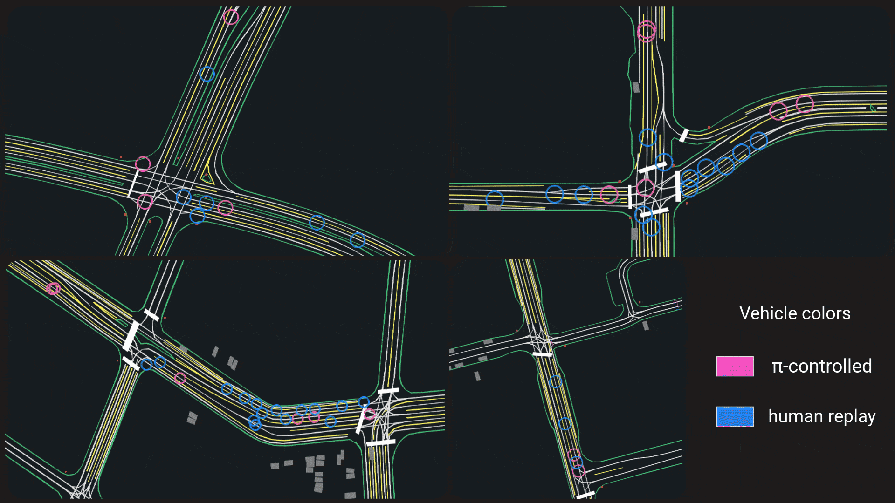

GPUDrive
========

 [](https://python-poetry.org/) [](https://arxiv.org/abs/2408.01584)

GPUDrive is a GPU-accelerated, multi-agent driving simulator that runs at 1 million FPS. The simulator is written in C++, built on top of the [Madrona Game Engine](https://madrona-engine.github.io). We provide Python bindings and `gymnasium` wrappers in `torch` and `jax`, allowing you to interface with the simulator in Python using your preferred framework.

For more details, see our [paper](https://arxiv.org/abs/2408.01584) 📜 and the 👉 [introduction tutorials](https://github.com/Emerge-Lab/gpudrive/tree/main/examples/tutorials), which guide you through the basic usage.

<figure>

<center><figcaption>Agents in GPUDrive can be controlled by any user-specified actor.</figcaption></center>
</figure>

## Integrations ⚙️

| What                                                                                                    | References                                                                                                                                                                     | README                                                                           | End-to-end training throughput<br />(`agent steps per second`) |
| ------------------------------------------------------------------------------------------------------- | ------------------------------------------------------------------------------------------------------------------------------------------------------------------------------ | -------------------------------------------------------------------------------- | ---------------------------------------------------------------- |
| **IPPO** implementation [Stable Baselines](https://github.com/DLR-RM/stable-baselines3/tree/master) | [IPPO](https://proceedings.neurips.cc/paper_files/paper/2022/file/9c1535a02f0ce079433344e14d910597-Paper-Datasets_and_Benchmarks.pdf)                                             | [Use](https://github.com/Emerge-Lab/gpudrive/blob/main/baselines/ippo/README.md) | 25,000                                                           |
| **IPPO** implementation [PufferLib](https://github.com/PufferAI/PufferLib) 🐡                       | [IPPO](https://proceedings.neurips.cc/paper_files/paper/2022/file/9c1535a02f0ce079433344e14d910597-Paper-Datasets_and_Benchmarks.pdf), [PufferLib](https://arxiv.org/pdf/2406.12905) | [Use](https://github.com/Emerge-Lab/gpudrive/blob/main/baselines/ippo/README.md), [Implementation](https://github.com/Emerge-Lab/gpudrive/blob/main/integrations/rl/puffer) | 260,000                                                          |

## Installation 🛠️

To build GPUDrive, ensure you have all the dependencies listed [here](https://github.com/shacklettbp/madrona#dependencies). Briefly, you'll need

1. CMake >= 3.24
2. Python >= 3.11
3. CUDA Toolkit >= 12.2 and <=12.4 (Currently we dont support CUDA versions 12.5+. Please check the ouptut of `nvcc --version` to make sure you are using correct CUDA version.)
4. For MacOS and Windows, you need to install all the dependencies of XCode and Visual Studio C++ tools resepectively.

Once you have the required dependencies, clone the repository (don't forget --recursive!):

```bash
git clone --recursive https://github.com/Emerge-Lab/gpudrive.git
cd gpudrive
```

---

<details>
  <summary>Optional: If you want to use the Madrona viewer in C++ (Not needed to render with pygame)</summary>

#### Extra dependencies to use Madrona viewer

  To build the simulator with visualization support on Linux (`build/viewer`), you will need to install X11 and OpenGL development libraries. Equivalent dependencies are already installed by Xcode on macOS. For example, on Ubuntu:

```bash
  sudo apt install libx11-dev libxrandr-dev libxinerama-dev libxcursor-dev libxi-dev mesa-common-dev libc++1
```

</details>

---

Then, you can *choose* between 3 options for building the simulator:

---

<details>
  <summary>Option 1️⃣ : Manual install</summary>

For Linux and macOS, use the following commands:

```bash
mkdir build
cd build
cmake .. -DCMAKE_BUILD_TYPE=Release
make -j # cores to build with, e.g. 32
cd ..
```

For Windows, open the cloned repository in Visual Studio and build the project using the integrated `cmake` functionality.

Next, set up the Python components of the repository with pip:

```bash
pip install -e . # Add -Cpackages.madrona_escape_room.ext-out-dir=PATH_TO_YOUR_BUILD_DIR on Windows
```

</details>

---

---

<details>
  <summary>Option 2️⃣ : Poetry install</summary>

First create a conda environment using `environment.yml`:

```bash
conda env create -f environment.yml
```

Activate the environment:

```bash
conda activate gpudrive
```

Run:

```bash
poetry install
```

</details>

---

---

<details>
  <summary>Option 3️⃣ : Docker (GPU Only) </summary>

#### Nvidia docker dependency

  To run the Docker image with GPU support, ensure that you have the NVIDIA Container Toolkit installed. Detailed installation instructions can be found here - https://docs.nvidia.com/datacenter/cloud-native/container-toolkit/latest/install-guide.html.

#### Pull the image and run the container

To pull our pre-built Docker image and begin using GPUDrive, execute the following command (you may need to prepend sudo, depending on your Docker setup):

```bash
  docker pull ghcr.io/emerge-lab/gpudrive:latest
```

After pulling the image, you can create and run a new container using the `--gpus all` flag. Currently cpu version in docker is not working (To be fixed soon). This command will create a new container named `gpudrive_container`:

```bash
  docker run --gpus all -it --name gpudrive_container ghcr.io/emerge-lab/gpudrive:latest
```

In case you created the container but exited, to rerun the same container, you can:

```bash
docker start gpudrive_container # make sure the container is started
docker exec -it gpudrive_container /bin/bash
```

Once in the container, it will look like this:

```bash
(gpudrive) root@8caf35a97e4f:/gpudrive#
```

The Docker image includes all necessary dependencies, along with Conda and Poetry. However, a compilation step is still required. Once inside the container, run:

```bash
 poetry install
```

#### Build the image from scratch

If you want to build the image from scratch, ensure that Docker is installed with the Buildx plugin (though classic builds will still work, they are soon to be deprecated). In the GPUDrive repository, run:

```bash
docker buildx build -t gpudrive .
```

The subsequent steps to run and manage the container remain the same as outlined above.

</details>

---

Test whether the installation was successful by importing the simulator:

```Python
import gpudrive
```

To avoid compiling on GPU mode everytime, the following environment variable can be set with any custom path. For example, you can store the compiled program in a cache called `gpudrive_cache`:

```bash
export MADRONA_MWGPU_KERNEL_CACHE=./gpudrive_cache
```

Please remember that if you make any changes in C++, you need to delete the cache and recompile.

## Getting started 🚀

To get started, see our [intro tutorials](https://github.com/Emerge-Lab/gpudrive/tree/main/examples/tutorials). These tutorials take approximately 30-60 minutes to complete and will guide you through the dataset, simulator, and how to populate the simulator with different types of actors.

<p align="center">
  
</p>

## Tests 📈

To further test the setup, you can run the pytests in the root directory:

```bash
pytest
```

To test if the simulator compiled correctly (and python lib did not), try running the headless program from the build directory.

```bash
cd build
./headless CPU 1 # Run on CPU, 1 step
```

## Pre-trained policy 🏋🏼‍♀️

We are open-sourcing a policy trained on 1,000 randomly sampled scenarios. You can download the pre-trained policy [here](https://drive.google.com/file/d/1N4KJrt5PG6Pu-ovBQ-zIp0sJH0AQodKq/view?usp=sharing). You can store the policy in ` models`.

## Dataset `{ 🚦 🚗  🚙  🛣️ }`

### Download the dataset

Two versions of the dataset are available:

- a mini-one that is about 1 GB and consists of 1000 training files and 100 validation / test files at: [Dropbox Link](https://www.dropbox.com/sh/8mxue9rdoizen3h/AADGRrHYBb86pZvDnHplDGvXa?dl=0).
- the full dataset (150 GB) and consists of 134453 training files and 12205 validation / test files: [Dropbox Link](https://www.dropbox.com/sh/wv75pjd8phxizj3/AABfNPWfjQdoTWvdVxsAjUL_a?dl=0)

The simulator supports initializing scenes from the `Nocturne` dataset. The input parameter for the simulator `json_path` takes in a path to a directory containing the files in the Nocturne format. The `SceneConfig` dataclass in `pygpudrive/env/config.py` dataclass is used to configure how scenes are selected from a folder with traffic scenarios.

### Re-building the dataset

GPUDrive is compatible with the complete [Waymo Open Motion Dataset](https://github.com/waymo-research/waymo-open-dataset), which contains over 100,000 scenarios. To download new files and create scenarios for the simulator, follow these three steps.

1. First, head to [https://waymo.com/open/](https://waymo.com/open/) and click on the "download" button a the top. After registering, click on the files from `v1.2.1 March 2024`, the newest version of the dataset at the time of wrting (10/2024). This will lead you a Google Cloud page. From here, you should see a folder structure like this:

```
waymo_open_dataset_motion_v_1_2_1/
│
├── uncompressed/
│   ├── lidar_and_camera/
│   ├── scenario/
│   │   ├── testing_interactive/
│   │   ├── testing/
│   │   ├── training_20s/
│   │   ├── training/
│   │   ├── validation_interactive/
│   │   └── validation/
│   └── tf_example/
```

2. Now, download files from testing, training and/or validation in the **`scenario`** folder. An easy way to do this is through `gsutil`.  First register using:

```bash
gcloud auth login
```

...then run the command below to download the dataset you prefer. For example, to download the validation dataset:

```bash
gsutil -m cp -r gs://waymo_open_dataset_motion_v_1_2_1/uncompressed/scenario/validation/ data/raw
```

where `data/raw` is your local storage folder. Note that this can take a while, depending on the size of the dataset you're downloading.

3. The last thing we need to do is convert the raw data to a format that is compatible with the simulator using:

```bash
python data_utils/process_waymo_files.py '<raw-data-path>' '<storage-path>' '<dataset>'
```

Note: Due to an open [issue](https://github.com/waymo-research/waymo-open-dataset/issues/868), installation of `waymo-open-dataset-tf-2.12.0` fails for Python 3.11. To use the script, in a separate Python 3.10 environment, run

```bash
pip install waymo-open-dataset-tf-2-12-0 trimesh[easy] python-fcl
```

Then for example, if you want to process the validation data, run:

```bash
python data_utils/process_waymo_files.py 'data/raw/' 'data/processed/' 'validation'
>>>
Processing Waymo files: 100%|████████████████████████████████████████████████████████████████| 150/150 [00:05<00:00, 28.18it/s]
INFO:root:Done!
```

and that's it!

> **🧐 Caveat**: A single Waymo tfrecord file contains approximately 500 traffic scenarios. Processing speed is about 250 scenes/min on a 16 core CPU. Trying to process the entire validation set for example (150 tfrecords) is a LOT of time.

## Citations

If you use GPUDrive in your work, please cite us:

```
@misc{kazemkhani2024gpudrivedatadrivenmultiagentdriving,
      title={GPUDrive: Data-driven, multi-agent driving simulation at 1 million FPS},
      author={Saman Kazemkhani and Aarav Pandya and Daphne Cornelisse and Brennan Shacklett and Eugene Vinitsky},
      year={2024},
      eprint={2408.01584},
      archivePrefix={arXiv},
      primaryClass={cs.AI},
      url={https://arxiv.org/abs/2408.01584},
}
```

## Contributing and learning benchmark 👷‍♀️

If you find a bug of are missing features, please feel free to [create an issue or start contributing](https://github.com/Emerge-Lab/gpudrive/blob/main/CONTRIBUTING.md)! That link also points to a **learning benchmark** complete with training logs and videos of agent behaviors via `wandb`.

## Timeline

[](https://star-history.com/#Emerge-Lab/gpudrive&Date)
