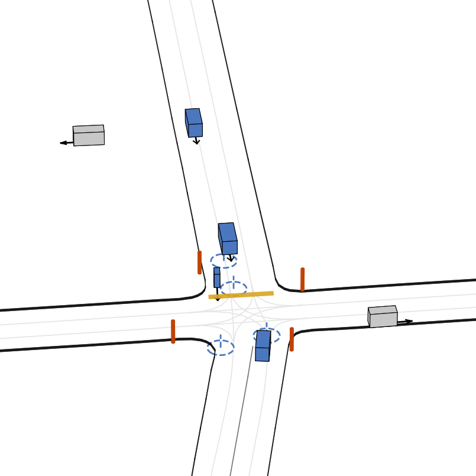
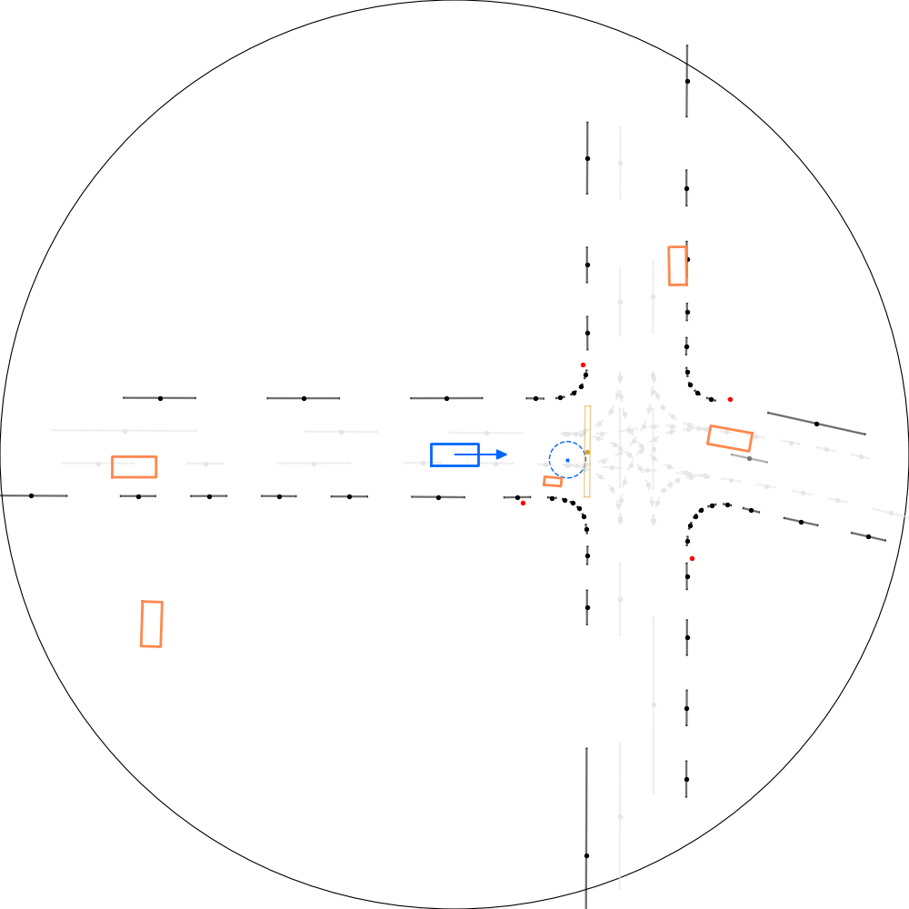
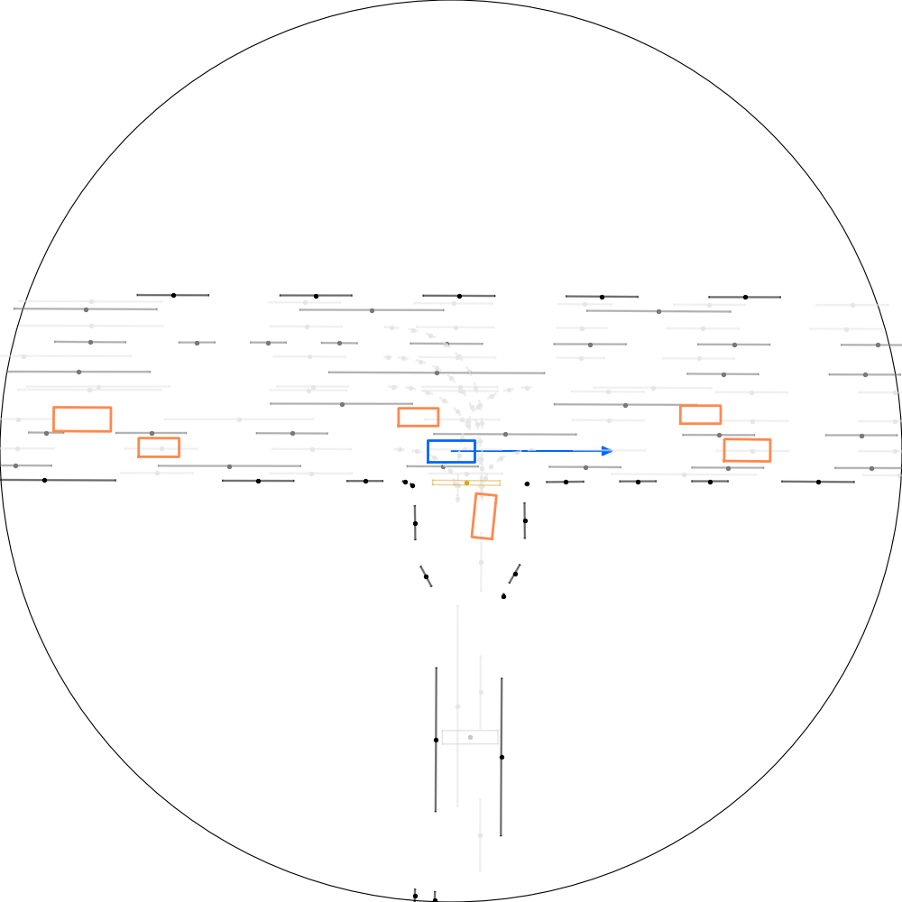

GPUDrive
========

 [](https://arxiv.org/abs/2408.01584)

An extremely fast, data-driven driving simulator written in C++.

## Highlights

- ⚡️ Fast simulation for agent development and evaluation at 1 million FPS through the [Madrona engine](https://madrona-engine.github.io/).
- 🐍 Provides Python bindings and `gymnasium` wrappers in `torch` and `jax`.
- 🏃‍➡️ Compatible with the [Waymo Open Motion Dataset](https://github.com/waymo-research/waymo-open-dataset), featuring over 100K scenarios with human demonstrations.
- 📜 Readily available PPO implementations via [SB3](https://github.com/DLR-RM/stable-baselines3) and [CleanRL](https://github.com/vwxyzjn/cleanrl) / [Pufferlib](https://puffer.ai/).
- 👀 Easily configure the simulator and agent views.
- 🎨 Diverse agent types: Vehicles, cyclists and pedestrians.

<div align="center">

| Simulator state                                                  | Agent observation                                                |
| ---------------------------------------------------------------- | ---------------------------------------------------------------- |
|     |  |
|  |  |

</div>

For details, see our [paper](https://arxiv.org/abs/2408.01584) and the [introduction tutorials](https://github.com/Emerge-Lab/gpudrive/tree/main/examples/tutorials), which guide you through the basic usage.

## Installation

To build GPUDrive, ensure you have all the required dependencies listed [here](https://github.com/shacklettbp/madrona#dependencies) including CMake, Python, and the CUDA Toolkit. See the details below.

<details> <summary>Dependencies</summary>

- CMake >= 3.24
- Python >= 3.11
- CUDA Toolkit >= 12.2 and <= 12.4 (We do not support CUDA versions 12.5+ at this time. Verify your CUDA version using nvcc --version.)
- On macOS and Windows, install the required dependencies for XCode and Visual Studio C++ tools, respectively.

</details>

After installing the necessary dependencies, clone the repository (don't forget the --recursive flag!):

```bash
git clone --recursive https://github.com/sounakban/gpudrive-CoDec.git
cd gpudrive
```

Then, there are two options for building the simulator:

---

<details>
  <summary>🔧 Option 1. Manual install </summary>

For Linux and macOS, use the following commands:

```bash
mkdir build
cd build
cmake .. -DCMAKE_BUILD_TYPE=Release
make -j # cores to build with, e.g. 32
cd ..
```

For Windows, open the cloned repository in Visual Studio and build the project using the integrated `cmake` functionality.

Next, set up a Python environment

#### With pyenv (Recommended)

Create a virtual environment:

```bash
pyenv virtualenv 3.11 gpudrive
pyenv activate gpudrive
```

Set it for the current project directory (optional):

```bash
pyenv local gpudrive
```

#### With conda

```bash
conda env create -f ./environment.yml
conda activate gpudrive
```

### Install Python package

Finally, install the Python components of the repository using pip:

```bash
# macOS and Linux.
pip install -e . 
```

Optional depencies include [pufferlib], [sb3] and [tests].

```bash
# On Windows.
pip install -e . -Cpackages.madrona_escape_room.ext-out-dir=PATH_TO_YOUR_BUILD_DIR on Windows
```

</details>

---

---

<details>
  <summary> 🐳  Option 2. Docker </summary>

To get started quickly, we provide a Dockerfile in the root directory.  

### Prerequisites  
Ensure you have the following installed:  
- [Docker](https://docs.docker.com/get-docker/)  
- [NVIDIA Container Toolkit](https://docs.nvidia.com/datacenter/cloud-native/container-toolkit/latest/install-guide.html)  

### Building the Docker mage  
Once installed, you can build the container with:  

```bash
DOCKER_BUILDKIT=1 docker build --build-arg USE_CUDA=true --tag my_image:latest --progress=plain .
```

### Running the Container  
To run the container with GPU support and shared memory:  

```bash
docker run --gpus all -it --rm --shm-size=20G -v ${PWD}:/workspace my_image:latest /bin/bash
```

</details>

---

Test whether the installation was successful by importing the simulator:

```Python
import madrona_gpudrive
```

To avoid compiling on GPU mode everytime, the following environment variable can be set with any custom path. For example, you can store the compiled program in a cache called `gpudrive_cache`:

```bash
export MADRONA_MWGPU_KERNEL_CACHE=./gpudrive_cache
```

Please remember that if you make any changes in C++, you need to delete the cache and recompile.

---

<details>
  <summary>Optional: If you want to use the Madrona viewer in C++</summary>

#### Extra dependencies to use Madrona viewer

  To build the simulator with visualization support on Linux (`build/viewer`), you will need to install X11 and OpenGL development libraries. Equivalent dependencies are already installed by Xcode on macOS. For example, on Ubuntu:

```bash
  sudo apt install libx11-dev libxrandr-dev libxinerama-dev libxcursor-dev libxi-dev mesa-common-dev libc++1
```

</details>

---

## Integrations


| What                                                                                                    | Info                                                                                                                                                                         | Run                                    | Training SPS |
| ------------------------------------------------------------------------------------------------------- | ---------------------------------------------------------------------------------------------------------------------------------------------------------------------------- | --------------------------------------------- | ------------------------------ |
| **IPPO** implementation [SB3](https://github.com/DLR-RM/stable-baselines3/tree/master) | [IPPO](https://proceedings.neurips.cc/paper_files/paper/2022/file/9c1535a02f0ce079433344e14d910597-Paper-Datasets_and_Benchmarks.pdf), [PufferLib](https://arxiv.org/pdf/2406.12905), [Implementation](https://github.com/Emerge-Lab/gpudrive/blob/main/integrations/ppo/puffer) | `python baselines/ppo/ppo_sb3.py`      | 25 - 50K                       |
| **IPPO** implementation [PufferLib](https://github.com/PufferAI/PufferLib) 🐡                           | [PPO](https://arxiv.org/pdf/2406.12905)                                                   | `python baselines/ppo/ppo_pufferlib.py`       | 100 - 300K                     |


## Getting started

To get started, see these entry points:

- Our [intro tutorials](https://github.com/Emerge-Lab/gpudrive/tree/main/examples/tutorials). These tutorials take approximately 30-60 minutes to complete and will guide you through the dataset, simulator, and how to populate the simulator with different types of actors.
- The [environment docs](https://github.com/Emerge-Lab/gpudrive/tree/main/gpudrive/env) provide detailed info on environment settings and supported features.

<!-- <p align="center">
  
</p> -->

<!-- ## 📈 Tests

To further test the setup, you can run the pytests in the root directory:

```bash
pytest
```

To test if the simulator compiled correctly (and python lib did not), try running the headless program from the build directory.

```bash
cd build
./headless CPU 1 # Run on CPU, 1 step
``` -->

## Pre-trained policies

Several pre-trained policies are available via the `PyTorchModelHubMixin` class on 🤗 huggingface_hub. 

- **Best Policy (10,000 Scenarios).** The best policy from [Building reliable sim driving agents by scaling self-play](https://arxiv.org/abs/2502.14706) is available here [here](https://huggingface.co/daphne-cornelisse/policy_S10_000_02_27). This policy was trained on 10,000 randomly sampled scenarios from the WOMD training dataset. 

- **Alternative Policy (1,000 Scenarios).** A policy trained on 1,000 scenarios can be found [here](https://huggingface.co/daphne-cornelisse/policy_S1000_02_27)

---

> Note: These models were trained with the environment configurations defined in `examples/experimental/config/reliable_agents_params.yaml`, changing environment/observation configurations will affect performance. 

---

### Usage

To load a pre-trained policy, use the following:
```Python
from gpudrive.networks.late_fusion import NeuralNet

# Load pre-trained model via huggingface_hub
agent = NeuralNet.from_pretrained("daphne-cornelisse/policy_S10_000_02_27")
```

See [tutorial 04](https://github.com/Emerge-Lab/gpudrive/tree/main/examples/tutorials/04_use_pretrained_sim_agent.ipynb) for all the details.

## Dataset

### Download the dataset

- Two versions of the dataset are available, a [mini version](https://huggingface.co/datasets/EMERGE-lab/GPUDrive_mini) with a 1000 training files and 300 test/validation files, and a [large dataset](https://huggingface.co/datasets/EMERGE-lab/GPUDrive) with 100k unique scenes.
- Replace 'GPUDrive_mini' with 'GPUDrive' below if you wish to download the full dataset.

<details>
  <summary>Download the dataset</summary>

To download the dataset you need the huggingface_hub library 

```bash
pip install huggingface_hub
```

Then you can download the dataset using python or just `huggingface-cli`.

- **Option 1**: Using Python

```python
>>> from huggingface_hub import snapshot_download
>>> snapshot_download(repo_id="EMERGE-lab/GPUDrive_mini", repo_type="dataset", local_dir="data/processed")
```

- **Option 2**: Use the huggingface-cli

1. Log in to your Hugging Face account:

```bash
huggingface-cli login
```

2. Download the dataset:

```bash
huggingface-cli download EMERGE-lab/GPUDrive_mini --local-dir data/processed --repo-type "dataset"
```

- **Option 3**: Manual Download

1. Visit https://huggingface.co/datasets/EMERGE-lab/GPUDrive_mini
2. Navigate to the Files and versions tab.
3. Download the desired files/directories.

_NOTE_: If you downloaded the full-sized dataset, it is grouped to subdirectories of 10k files each (according to hugging face constraints). In order for the path to work with GPUDrive, you need to run

```python
python data_utils/extract_groups.py #use --help if you've used a custom download path
```

</details>

### Re-build the dataset

If you wish to manually generate the dataset, GPUDrive is compatible with the complete [Waymo Open Motion Dataset](https://github.com/waymo-research/waymo-open-dataset), which contains well over 100,000 scenarios. To download new files and create scenarios for the simulator, follow the steps below.

<details>
  <summary>Re-build the dataset in 3 steps</summary>

1. First, head to [https://waymo.com/open/](https://waymo.com/open/) and click on the "download" button a the top. After registering, click on the files from `v1.2.1 March 2024`, the newest version of the dataset at the time of wrting (10/2024). This will lead you a Google Cloud page. From here, you should see a folder structure like this:

```
waymo_open_dataset_motion_v_1_2_1/
│
├── uncompressed/
│   ├── lidar_and_camera/
│   ├── scenario/
│   │   ├── testing_interactive/
│   │   ├── testing/
│   │   ├── training_20s/
│   │   ├── training/
│   │   ├── validation_interactive/
│   │   └── validation/
│   └── tf_example/
```

2. Now, download files from testing, training and/or validation in the **`scenario`** folder. An easy way to do this is through `gsutil`.  First register using:

```bash
gcloud auth login
```

...then run the command below to download the dataset you prefer. For example, to download the validation dataset:

```bash
gsutil -m cp -r gs://waymo_open_dataset_motion_v_1_2_1/uncompressed/scenario/validation/ data/raw
```

where `data/raw` is your local storage folder. Note that this can take a while, depending on the size of the dataset you're downloading.

3. The last thing we need to do is convert the raw data to a format that is compatible with the simulator using:

```bash
python data_utils/process_waymo_files.py '<raw-data-path>' '<storage-path>' '<dataset>'
```

Note: Due to an open [issue](https://github.com/waymo-research/waymo-open-dataset/issues/868), installation of `waymo-open-dataset-tf-2.12.0` fails for Python 3.11. To use the script, in a separate Python 3.10 environment, run

```bash
pip install waymo-open-dataset-tf-2-12-0 trimesh[easy] python-fcl
```

Then for example, if you want to process the validation data, run:

```bash
python data_utils/process_waymo_files.py 'data/raw/' 'data/processed/' 'validation'
>>>
Processing Waymo files: 100%|████████████████████████████████████████████████████████████████| 150/150 [00:05<00:00, 28.18it/s]
INFO:root:Done!
```

and that's it!

> **🧐 Caveat**: A single Waymo tfrecord file contains approximately 500 traffic scenarios. Processing speed is about 250 scenes/min on a 16 core CPU. Trying to process the entire validation set for example (150 tfrecords) is a LOT of time.

</details>

### Post-processing
- Running `python data_utils/postprocessing.py` filters out corrupted files and undoes hugging face directory grouping.

## 📜 Citing GPUDrive

If you use GPUDrive in your research, please cite our ICLR 2025 paper
```bibtex
@inproceedings{kazemkhani2025gpudrive,
      title={GPUDrive: Data-driven, multi-agent driving simulation at 1 million FPS}, 
      author={Saman Kazemkhani and Aarav Pandya and Daphne Cornelisse and Brennan Shacklett and Eugene Vinitsky},
      booktitle={Proceedings of the International Conference on Learning Representations (ICLR)},
      year={2025},
      url={https://arxiv.org/abs/2408.01584},
      eprint={2408.01584},
      archivePrefix={arXiv},
      primaryClass={cs.AI},
}
```

## Contributing

If you encounter a bug, notice a missing feature, or want to contribute, feel free to create an issue or reach out! We'd be excited to have you involved in the project.
