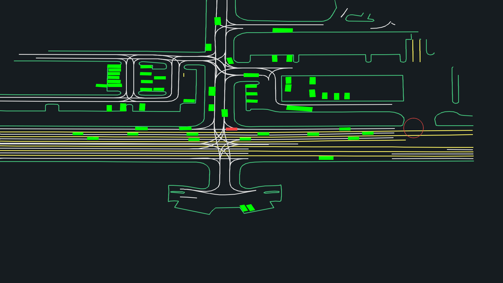
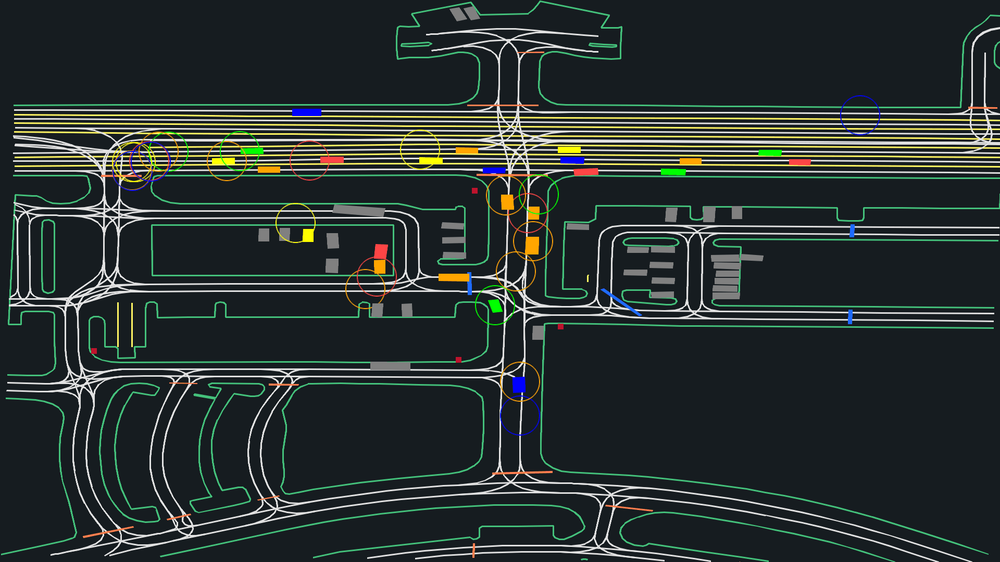
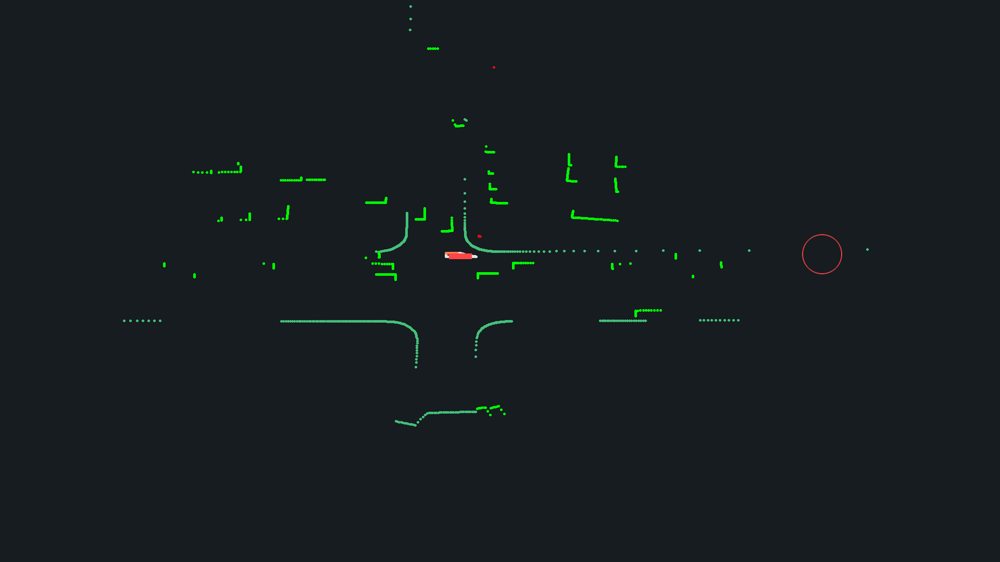
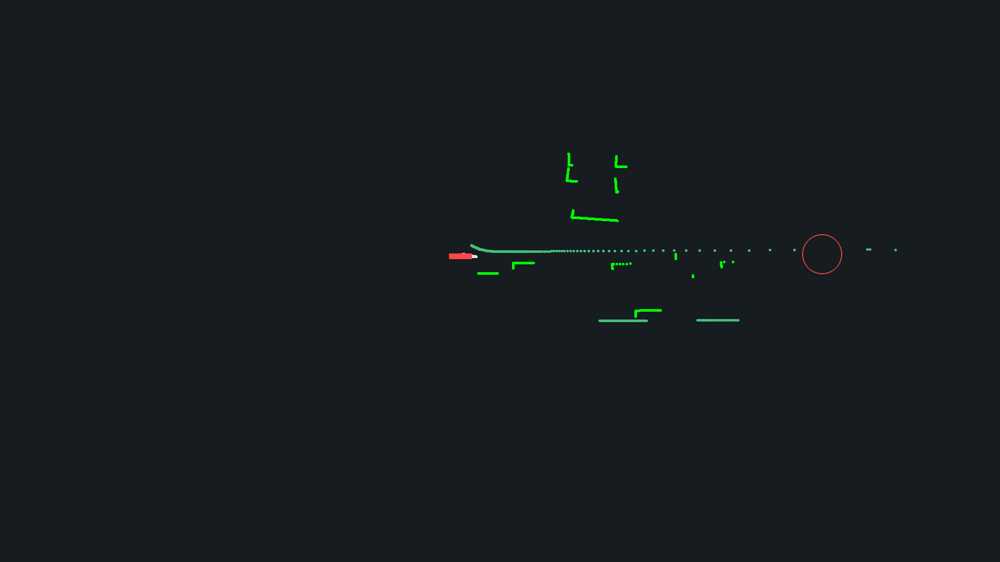

GPUDrive
============================

This is an Batch RL environment simulator of Nocturne built on the [Madrona Engine](https://madrona-engine.github.io). It supports loading multiple worlds with multi agent support. Python bindings are exposed for easy integration with RL algorithms.

<p align="center">
  
  
  
  
</p>

Build Instructions
--------
First, make sure you have all the dependencies listed [here](https://github.com/shacklettbp/madrona#dependencies) (briefly, recent python and cmake, as well as Xcode or Visual Studio on MacOS or Windows respectively).

To build the simulator with visualization support on Linux (`build/viewer`), you also need to install X11 and OpenGL development libraries. Equivalent dependencies should already be installed by Xcode on MacOS.
For example, on Ubuntu:
```bash
sudo apt install libx11-dev libxrandr-dev libxinerama-dev libxcursor-dev libxi-dev mesa-common-dev libc++1

```

Now that you have the required dependencies, fetch the repo (don't forget `--recursive`!):
```bash
git clone --recursive https://github.com/Emerge-Lab/gpudrive.git
cd gpudrive
```

# Manual Install

Next, for Linux and MacOS: Run `cmake` and then `make` to build the simulator:
```bash
mkdir build
cd build
cmake .. -DCMAKE_BUILD_TYPE=Release
make -j # cores to build with
cd ..
```

Or on Windows, open the cloned repository in Visual Studio and build
the project using the integrated `cmake` functionality.


Now, setup the python components of the repository with `pip`:
```bash
pip install -e . # Add -Cpackages.madrona_escape_room.ext-out-dir=PATH_TO_YOUR_BUILD_DIR on Windows
```

# Poetry install

### Conda 

Create a conda environment using `environment.yml` and then run `poetry install`

```bash
conda env create -f environment.yml
conda activate gpudrive
poetry install
```

# Running the simulator

## Dataset

### Downloading the dataset
Two versions of the dataset are available:
- a mini-one that is about 1 GB and consists of 1000 training files and 100 validation / test files at: [Dropbox Link](https://www.dropbox.com/sh/8mxue9rdoizen3h/AADGRrHYBb86pZvDnHplDGvXa?dl=0).
- the full dataset (150 GB) and consists of 134453 training files and 12205 validation / test files: [Dropbox Link](https://www.dropbox.com/sh/wv75pjd8phxizj3/AABfNPWfjQdoTWvdVxsAjUL_a?dl=0)

The simulator supports initializing scenes from the Nocturne dataset. The input parameter for the simulator `json_path` takes in a path to a directory containing the files in the Nocturne format. The directory should contain a `valid_files.json` with a list of the files to be initialized.

To control which files get initialized, the input parameter `datasetInitOptions` can be used. The parameter can have the following options - 

* `FirstN` - Initialized the first `num_worlds` files from the `valid_files.json`. Ensure that the `valid_files.json` contains atleast `num_worlds` files.
* `RandomN` - Shuffles the files in `valid_files.json` and initializes `num_worlds` randomly. Ensure that the `valid_files.json` contains atleast `num_worlds` files.
* `PadN` -  Tries to initialize as many files as available and then pads the initializer list by repeating the first file until `num_worlds` files.
* `ExactN` - Takes exactly `num_worlds` files from the `valid_files.json`. Ensure that the `valid_files.json` contains exactly `num_worlds` files.

## Run the sim
To test that the simulator compiled and installed correctly, run pytests in the root directory

```bash
pytest
```

Alternatively, to test if the simulator compiled correctly (and python lib did not), try running the headless program from the build directory. Remember to change the location of the data in `src/headless.cpp` and compiling again before running it.

```bash
cd build
./headless CPU 1 1 # Run on CPU , 1 world, 1 step
```

To interface with the sim, checkout the [tutorial notebook](https://github.com/Emerge-Lab/gpudrive/blob/main/examples/tutorials/sim_demo.ipynb).


The Environment and Learning Task
--------------

The codebase trains a shared policy that controls agents individually with direct engine inputs rather than pixel observations. Agents interact with the simulator as follows:

### Action Space:
 * Acceleration: Continuous float values for acceleration applied to the agents.
 * Steering angle: Continuous float values for steering angle applied according to the bicycle kinematic model.
 * Heading angle (currently unused): Continuous float values for heading angle. This controls where the agent is looking.

### Observation Space:

**SelfObservation**

The `SelfObservation` tensor of shape `(5,)` for each agent provides information about the agent's own state. The respective values are 

- `SelfObservation[0]`: Represents the current *speed* of the agent.
- `SelfObservation[1:3]` : *length* and *width* of the agent.
- `SelfObservation[3:5]`: *Coordinates (x,y)* of the goal relative to the agent. 
- `SelfObservation[5]`: Represents if the agent has collided. Values in `{0,1}`.

**MapObservation**

The `MapObservation` tensor of shape `(4,)` for each agent provides the *absolute* position of map objects. The values are 

- `MapObservation[0:2]`: Represents the position of the `MapObject`
- `MapObservation[2:5]`: Represents the scale of the `MapObject` in terms of length, width and height
- `MapObservation[5]`: Represents the heading angle of the `MapObject`
- `MapObservation[6]`: Represents the type of the Map Object.

**PartnerObservation**

The `PartnerObservation` tensor of shape `(num_agents-1,7)` for each agent provides information about other agents in the range `params.observationRadius`. All the values in this tensor are *relative to the ego agent*. The respective values for each `PartnerObservation` are

- `PartnerObservation[0]`: The *speed* of the observed neighboring agent.
- `PartnerObservation[1:3]`: The *position (x,y)* of the observed neighbouring agent.
- `PartnerObservation[3]`: The *orientation* of the neighboring agent.
- `PartnerObservation[4:6]`: The *length* and *width* of the neighbouring agent.
- `PartnerObservation[6]`: The type of agent. 

**AgentMapObservations**

The `AgentMapObservations` tensor of shape (num_road_objs, 7) for each agent provides information about the road objects in the range `params.observationRadius`. All the values in this tensor are *relative to the ego agent*. The respective values for each `AgentMapObservations` are the same as `MapObservations`.

## Configuring the Sim 
The `SimManager` constructor takes in a `params` object that can be used to configure various aspects of the Sim. 

### Rewards 
* `RewardType`: There are 3 types of rewards that can be exported from the sim. 
  - `DistanceBased` - Exports the distance of the agent to the goal. 
  - `OnGoalAchieved` - Exports 1 if the agent has reached the goal, else 0.
  - `Dense`(Not Implemented)- Exports the distance of the agent from its expert trajectory specified in the dataset.
* `distanceToGoalThreshold`: This threshold is used to determine if the agent has reached the goal or not. `Default: 0.0`
* `distanceToExpertThreshold`: This threshold is used to determine agent is following the expert trajectory or not. `Default: 0.0`

### Road reduction algorithm
To manage the performance and simplify the observation space of the simulator, we apply a polyline reduction algorithm on the road edges, lines and lanes. We use the ['Visvalingam-Whyatt Algorithm'](https://en.wikipedia.org/wiki/Visvalingam%E2%80%93Whyatt_algorithm).

* `polylineReductionThreshold`: This threshold determines how much reduction is to be applied to the road lines. Ranges from `0` to `+ve inf`. If set to `0`, no reduction will be applied. `Default: 0.5`

### Collision Behaviour
For easy troubleshooting and learning various policies, the behaviour of the agents on collisions can be configured. 

* `AgentStop`: The agents in collision would simply stop at the point of collisions. No further actions will be applied on these agents. 
* `AgentRemoved`: The agents in collision would simply be removed from the scene. 
* `Ignore`: The agents in collision still output that they collided, but they will continue to move around as if they did not collide. 

### Misc params 

* `ObservationRadius` : Defines the radius of the circle within which an agent can observe its surrounding. The outputs in observation are set to invalid type for the objects not in the `ObservationRadius` and its observations are zeroed out.
* `MaxNumControlledVehicles` : Controls how many maximum agents can be controlled in the sim. Specifically, we try to initialize as many controlled agents as possible. However, a particular file may have lesser valid agents, in which case certain worlds may not have as many controlled agents. We pick the first `MaxNumControlledVehicles` **valid** agents to control, and the rest are controlled via their expert trajectories.
* `IgnoreNonVehicles` : Defines the policy of not initializing pedestrians/cyclists. Default: `false`.
* `roadObservationAlgorithm`: Select from `KNearestEntitiesWithRadiusFiltering` and `AllEntitiesWithRadiusFiltering`. The `KNearestEntitiesWithRadiusFiltering` filters out `kMaxAgentMapObservationsCount` nearest points in the `observationRadius` of the agents, while `AllEntitiesWithRadiusFiltering` runs a linear search in the same radius. Default: `KNearestEntitiesWithRadiusFiltering`
* `initOnlyValidAgentsAtFirstStep`: Controls if only the agents that are valid at the first step are intialized into the sim. Default: `true`.
* `isStaticAgentControlled`: Controls if agents like parked vehicles who are already at their goals should be allowed to be controlled or set as static. Default: `false`.
* `enableLidar`: Enables lidar observations.
* `disableClassicalObs`: Disables setting `PartnerObservations` and `AgentMapObservations`. Generally this would be used to speed up sim if lidar observations are turned on and the above observations are not used. Default: `false`.
* `useWayMaxModel`: Sets if the waymax dynamics model should be used. Default: `false`.

### Types of objects

* Road types:
    - `RoadEdge`
    - `RoadLine`
    - `RoadLane`
    - `CrossWalk`
    - `SpeedBump`
    - `StopSign`
* Agent types:
    - `Vehicle`
    - `Pedestrian`
    - `Cyclist`

* `Padding` type - This is a special type that is used to pad entities in different worlds to ensure consistent output shapes.

* `None` type - This is a special type that is used to mark entities as invalid and should not be considered for learning. It can arise if an entity is outside `ObservationRadius` or if the entity collided and the collision behaviour is set to `AgentRemoved`. 


Citation
--------
This batch-simulator is made in thanks to Madrona Engine.

```
@article{...,
}
```
