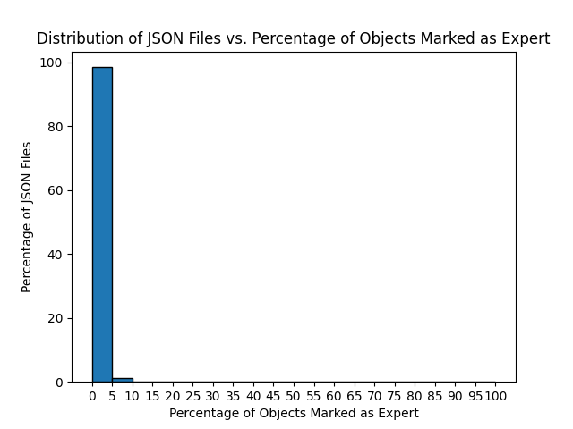

## Why do we need to process Waymo files?
- GPUDrive works with a subset of information given in a Waymo scene, in json format.
- Processing script deserializes Waymo tfrecords according to their protobuf format and generates json files compatible with GPUDrive.

## What exactly happens when processing a Waymo tfrecord?
- Each Waymo tfrecord contains about 500 scenes, with all assiciated information regarding road objects, vehicles, traffic lights, etc.
- [process_waymo_files.py](process_waymo_files.py) generates a json file for each scene in the tfrecord in parallel.
- During processing, we mark certain vehicles as "expert" meaning they cannot be controlled in the sim.

## Why do we mark some vehicles as experts?
- In the ground truth Waymo vehicle trajectories, a small minority of them involve crossing a road edge entity. 
- GPUDrive interprets this as a collision and subsequently going offroad. Hence these vehicles fail to make it to their goals.
- This leads to inaccuracies in evaluating policies with respect to rate of reaching goals.
- Marking them as "expert" makes them uncontrolled in the sim, and hence are not considered in evaluation.

## How do we check if a vehicle should be marked expert?
- For each Waymo scene we process, we construct all road edges, and all vehicle trajectories. 
- For each vehicle trajectory, if it intersects with a road edge, we set an expert flag in the json.
- Then when a scene is loaded into the sim, it checks for this flag and behaves accordingly.

## How many of these experts even exist in the first place?
- In the entire training set (>100k scenes), we found 31837 vehicles (roughly 0.35% of all vehicles) marked expert. 
