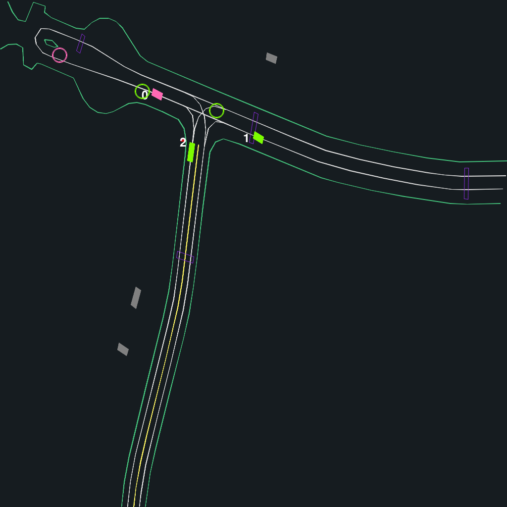

## Controlling road objects

Agents in the simulator can be controlled by any user-specified actor. In this tutorial, we show how you can set the behavior of road objects in the scenes.

Currently, we support 3 actor types are supported:

* `RandomActor`: An actor that takes random actions from the action space.
* `HumanExpertActor`: Stepped by the human (expert) driving logs
* `PolicyActor`: Uses a learned policy to take actions.

We demonstrate how to use different actors in a scene. Here, we show the settings and the resulting videos and behaviors. To reproduces these videos, you can run `04_multi_actors_demo.py` with various settings.

### Create and configure environment

As usual, we first define our environment with the desired settings:

```python
env_config = EnvConfig()
scene_config = SceneConfig(
    path=DATA_PATH,
    num_scenes=NUM_WORLDS,
    discipline=SelectionDiscipline.FIRST_N,
    k_unique_scenes=K_UNIQUE_SCENES,
)
render_config = RenderConfig(
    draw_obj_idx=True,
)

env = GPUDriveTorchEnv(
    config=env_config,
    scene_config=scene_config,
    render_config=render_config,
    max_cont_agents=MAX_CONTROLLED_AGENTS,
    device=DEVICE,
)
```

### Example 1: Populate the environment with different actors

Now we can choose the actors that control the vehicles in the scenarios. To start, say I want to control agent `0` with a random actor and the rest with a learned policy that I stored in `models/*`. We first create the actors as follows:

```python
from pygpudrive.agents.random_actor import RandomActor
from pygpudrive.agents.policy_actor import PolicyActor
from pygpudrive.agents.core import merge_actions

obj_idx = torch.arange(MAX_CONTROLLED_AGENTS)

# Define actors
rand_actor = RandomActor(
    env=env,
    is_controlled_func=(obj_idx == 0),
)

policy_actor = PolicyActor(
    is_controlled_func=obj_idx > 0,
    saved_model_path="models/policy_23066479.zip",
)
```

Now we step through an episode, using the two actors to take actions for the respective actors.

```python
 for time_step in range(EPISODE_LENGTH):

    # SELECT ACTIONS
    rand_actions = rand_actor.select_action()
    rl_agent_actions = policy_actor.select_action(obs)

    # MERGE ACTIONS FROM DIFFERENT SIM AGENTS
    actions = merge_actions(
        actions={
            "pi_rand": rand_actions,
            "pi_rl": rl_agent_actions,
        },
        actor_ids={
            "pi_rand": rand_actor.actor_ids,
            "pi_rl": policy_actor.actor_ids,
        },
        reference_actor_shape=obj_idx,
    )

    # STEP
    env.step_dynamics(actions)

    # GET NEXT OBS
    obs = env.get_obs()

    # RENDER
    frame = env.render(
        world_render_idx=0,
        actor_to_idx={
                'rand': rand_actor.actor_ids.tolist(),
                'policy': policy_actor.actor_ids.tolist()
            }
    )
    frames.append(frame)
```

This generates the following behavior:

* The pink vehicle with `idx = 0` is controlled by the `RandomActor`
* The other vehicles in the scene, here `idx = 1 and idx = 2` are controlled by the learned `PolicyActor`

<figure>

</figure>

### ### Example 2: Set up evaluation with human drivers
