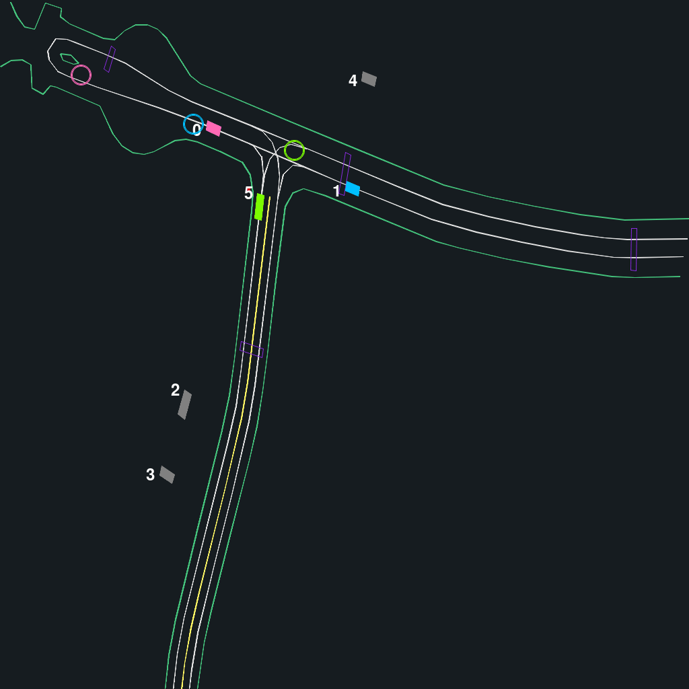

## 4. Controlling road objects

Agents in the simulator can be controlled by any user specified policy. In this tutorial, we show how you can set the behavior of road objects in the scenes.

### 4.1 Expert control

By default, that is, if no actions are specified, agents are stepped using the logged human trajectories. This mode is also referred to as _log-replay_ or _expert-control_. To step agents with the human driving logs, simply set `actions=None`. Here we run an episode without specifying any actions:

```Python
actions = None
for time_step in range(EPISODE_LENGTH):
  
    # STEP
    env.step_dynamics(actions)

    obs = env.get_obs()
    reward = env.get_rewards()
    done = env.get_dones()

    # RENDER
    frame = env.render(world_render_idx=0)
    frames.append(frame)

```

This results in the following behavior:



### 4.2 Control subset of agents with a policy, the rest with expert-control

### 4.3 Control agents with different policies
