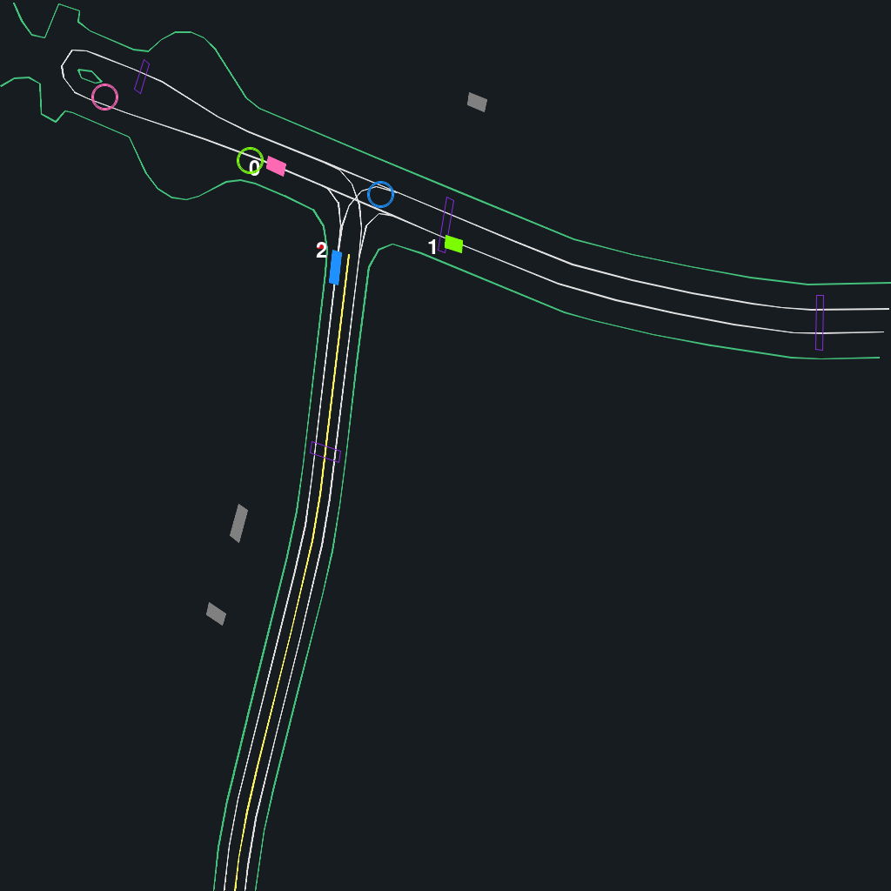

## Controlling road objects 🕹️

In this tutorial, we demonstrate how to control agents in the simulator using user-specified actors.

At the moment, we support three types of actors:

* [`RandomActor`](https://github.com/Emerge-Lab/gpudrive/blob/dc/multi_actors_demo/pygpudrive/agents/random_actor.py): Takes random actions from the action space.
* [`HumanExpertActor`](https://github.com/Emerge-Lab/gpudrive/blob/dc/multi_actors_demo/pygpudrive/agents/expert_actor.py): Operates based on the recorded human driving logs.
* [`PolicyActor`](https://github.com/Emerge-Lab/gpudrive/blob/dc/multi_actors_demo/pygpudrive/agents/policy_actor.py): Uses a learned policy to take actions.

---

> 🤖 **It is easy to define your own actor.** Just make sure it has a `select_action(obs)` method (see `SimAgentActor `in `pygpudrive/agents/sim_agent.py` for the expected structure).

---

We show how to use different actors in a scene and resulting behaviors. To reproduce these results, you can play around with the associated python script: `04_multi_actors_demo.py` .

### Create and configure environment

As usual, we first define our environment with the desired settings:

```python
# Constants
EPISODE_LENGTH = 90
MAX_CONTROLLED_AGENTS = 128
NUM_WORLDS = 1
K_UNIQUE_SCENES = 1
DEVICE = "cuda"
DATA_PATH = "data"

# Configure
env_config = EnvConfig()
scene_config = SceneConfig(
    path=DATA_PATH,
    num_scenes=NUM_WORLDS,
    discipline=SelectionDiscipline.FIRST_N,
    k_unique_scenes=K_UNIQUE_SCENES,
)
render_config = RenderConfig(
    draw_obj_idx=True, # If True, draws the indices of the vehicles for easy inspection
)

# Make env
env = GPUDriveTorchEnv(
    config=env_config,
    scene_config=scene_config,
    render_config=render_config,
    max_cont_agents=MAX_CONTROLLED_AGENTS,
    device=DEVICE,
)
```

### Example 1: Populate the environment with different actors

Say you have just trained a policy $\pi$ and would like to investigate how well it pairs with agents that take completely random actions. For no particular reason, we let a single object per scene be controlled by the random actor and the remaining of the agents with your *learned policy* (that is stored in `models/*`). 

We can do this as follows:

```python
from pygpudrive.agents.random_actor import RandomActor
from pygpudrive.agents.policy_actor import PolicyActor
from pygpudrive.agents.core import merge_actions

obj_idx = torch.arange(MAX_CONTROLLED_AGENTS)

# Define actors
rand_actor = RandomActor(
    env=env,
    is_controlled_func=(obj_idx == 0), 
)

policy_actor = PolicyActor(
    is_controlled_func=obj_idx > 0, # Remainder of the vehicles in a scene
    saved_model_path="models/policy_23066479.zip",
)
```

Now we step through an episode, using the two actors to take actions for the respective vehicles:

```python
 for time_step in range(EPISODE_LENGTH):

    # SELECT ACTIONS
    rand_actions = rand_actor.select_action()
    rl_agent_actions = policy_actor.select_action(obs)

    # MERGE ACTIONS FROM DIFFERENT SIM AGENTS
    actions = merge_actions(
        actions={
            "pi_rand": rand_actions,
            "pi_rl": rl_agent_actions,
        },
        actor_ids={
            "pi_rand": rand_actor.actor_ids,
            "pi_rl": policy_actor.actor_ids,
        },
        reference_actor_shape=obj_idx,
    )

    # STEP
    env.step_dynamics(actions)

    # GET NEXT OBS
    obs = env.get_obs()

    # RENDER
    frame = env.render(
        world_render_idx=0,
       color_objects_by_actor={
                'rand': rand_actor.actor_ids.tolist(),
                'policy': policy_actor.actor_ids.tolist()
            }
    )
    frames.append(frame)
```

Done! Now let's inspect our agents.

* The pink vehicle with `idx = 0` is controlled by the `RandomActor`
* The other vehicles in the scene, here `idx = 1 and idx = 2` are controlled by the learned `PolicyActor`

---
> 🎨 Notice that the vehicles are colored by their actor type, this is done with the `color_objects_by_actor` argument in the `render()` method.
---

<figure>

</figure>

### Example 2: Evaluation with human drivers

This time, say you are rather interested in evaluating your learned policy not just with random but also with _human_ agents.

Now we define three different actors...

```python
from pygpudrive.agents.expert_actor import HumanExpertActor
from pygpudrive.agents.policy_actor import PolicyActor
from pygpudrive.agents.core import merge_actions

obj_idx = torch.arange(MAX_CONTROLLED_AGENTS)

rand_actor = RandomActor(
    env=env, is_controlled_func=(obj_idx == 0)
)

expert_actor = HumanExpertActor(
    is_controlled_func=(obj_idx == 1),
)

policy_actor = PolicyActor(
    is_controlled_func=obj_idx > 1,
    saved_model_path="models/policy_23066479.zip",
)
```

... and repeat the procedure above, except with the new actors:

```python
for time_step in range(EPISODE_LENGTH):

    # SELECT ACTIONS
    rand_actions = rand_actor.select_action()
    expert_actions = expert_actor.select_action(obs)
    rl_agent_actions = policy_actor.select_action(obs)

    # MERGE ACTIONS FROM DIFFERENT SIM AGENTS
    actions = merge_actions(
        actions={
            "pi_rand": rand_actions,
            "pi_rl": rl_agent_actions,
            "pi_expert": expert_actions,
        },
        actor_ids={
            "pi_rand": rand_actor.actor_ids,
            "pi_rl": policy_actor.actor_ids,
            "pi_expert": expert_actor.actor_ids,
        },
        reference_actor_shape=obj_idx,
    )

    # STEP
    env.step_dynamics(actions.reshape(1, MAX_CONTROLLED_AGENTS))

    # GET NEXT OBS
    obs = env.get_obs()

    # RENDER
    frame = env.render(
        world_render_idx=0,
        color_objects_by_actor={
            "rand": rand_actor.actor_ids.tolist(),
            "policy": policy_actor.actor_ids.tolist(),
            "expert": expert_actor.actor_ids.tolist(),
        },
    )
    frames.append(frame)
```

Now we can see that:

* The _zigzagging_ pink vehicle with `idx = 0` is controlled by the `RandomActor`
* The blue vehicle with `idx = 1` follows the human driving log (`HumanExpertActor`)
* The green vehicle with `idx = 2` is controlled by the learned `PolicyActor`

<figure>

</figure>
