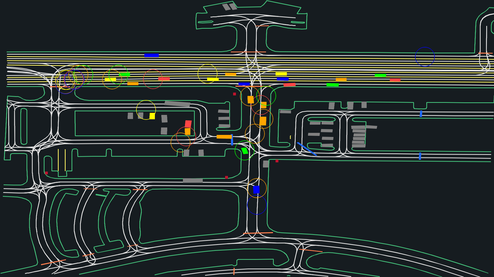
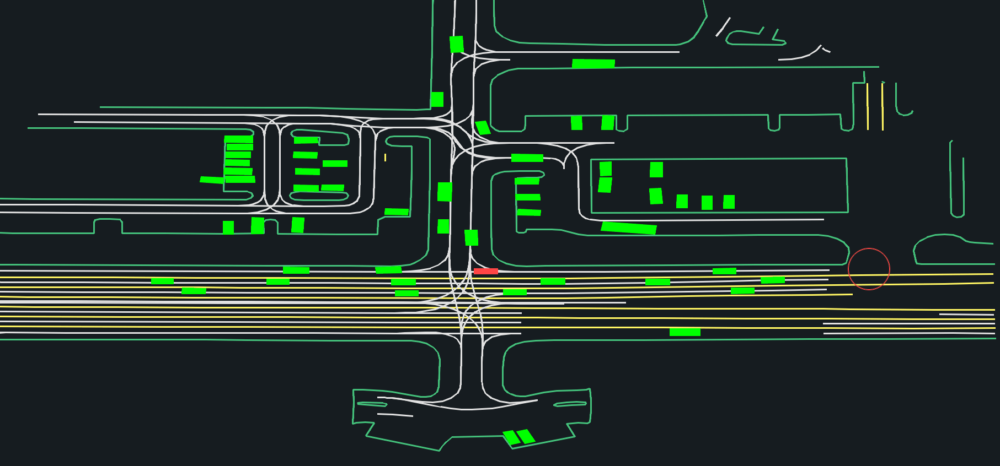
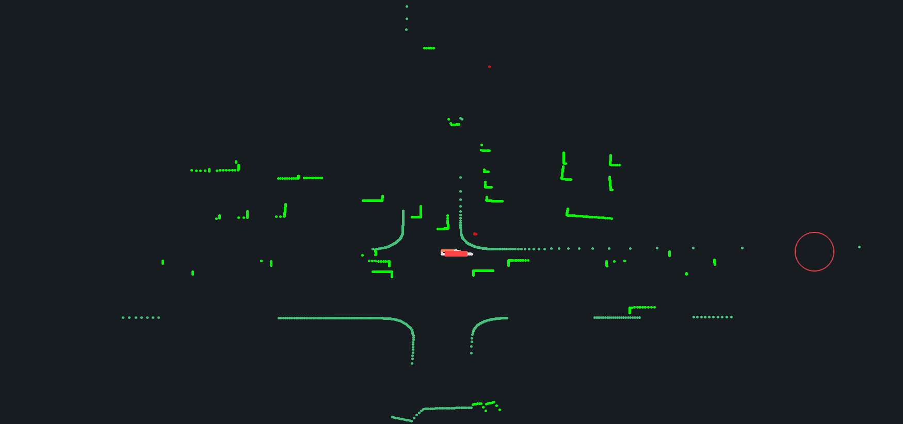
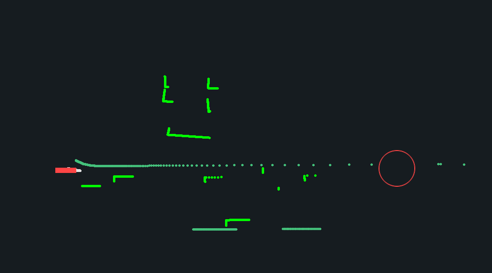

# GPU Drive Multi-Agent Environment

This repository provides base gymnasium environments for multi-agent reinforcement learning using `torch` and `jax` in to interface with the `gpudrive` simulator. It follows the `gymnasium` environment standards as closely as possible.

## Quick Start

To get started we use the readily available data in the `data/processed/examples` folder. See [here](https://github.com/Emerge-Lab/gpudrive/tree/main?tab=readme-ov-file#dataset-------%EF%B8%8F-) for how to download more data (traffic scenarios).

Configure the environment using the basic settings in `config`:

```Python
config = EnvConfig()
```

This `config` contains all environment parameters. One important configuration is the dynamics model, which determines how a successor state is computed (e.g. position, yaw, velocity) of one or more objects given an action (e.g. steering and acceleration).

The following dynamics models are currently implemented:

- `Classic`: A kinematic bicycle model uses the center of gravity as reference point with 2D action (acceleration, steering curvature). It was used for [Nocturne](https://arxiv.org/pdf/2206.09889).
- `InvertibleBicycleModel`. A kinematically realistic model using a 2D action: acceleration, steering curvature (taken from [source](https://github.com/waymo-research/waymax/tree/main/waymax/dynamics)).
- `DeltaLocal`. A position-based model using a 3D action (dx, dy, dyaw) representing the displacement of an object relative to the current position and orientation. This model does not check for infeasible actions, and large displacements may lead to unrealistic behavior (taken from [source](https://github.com/waymo-research/waymax/tree/main/waymax/dynamics)).
- `StateDynamics`. A position-based model using a 10D action (x, y, z, yaw, velocity x, vel y, vel z, ang_vel_x, ang_vel_y, ang_vel_z) that directly sets values in the state in global coordinates. This model does not check for infeasible actions (taken from [source](https://github.com/waymo-research/waymax/tree/main/waymax/dynamics)).

For example, this creates an environment with one world and a maximum of three controllable agents per scenario:

```Python
env = GPUDriveTorchEnv(
    config=config,
    num_worlds=1, # parallelism
    max_cont_agents=3, # maximum number of agents to control per scene
    data_dir="data/processed/examples", # Path to data folder
)
```

Step the environment using:

```Python
env.step_dynamics(actions)

# Extract info
obs = env.get_obs()
reward = env.get_rewards()
done = env.get_dones()
```

Further configuration details are available in `config.py`.

---

> **❗️** You can filter the information from the agents you control using `env.cont_agent_mask`. This boolean mask is of shape `(num_worlds, kMaxAgentCount)`, where kMaxAgentCount defaults to 128 and is set in `consts.hpp`. It marks True for agents under your control and False for all others.

---

## Action Space

### Discrete (default; `action_type='discrete'`)

Generates a grid of possible actions. The action space depends on the `dynamics_model`.

For example, with the `dynamics_model: str = "classic"` the default is:

```Python
# Action space (joint discrete)
head_tilt_actions: torch.Tensor = torch.Tensor([0])
steer_actions: torch.Tensor = torch.round(
    torch.linspace(-1.0, 1.0, 13), decimals=3
)
accel_actions: torch.Tensor = torch.round(
    torch.linspace(-3, 3, 7), decimals=3
)
```

### Continuous

To use a continuous action space, set `action_type='continuous`

## Observation Space

Key observation flags include:

```
ego_state: bool = True  # Indicates ego vehicle state
road_map_obs: bool = True  # Provides road graph data
partner_obs: bool = True  # Includes partner vehicle information
norm_obs: bool = True  # Normalizes observations if true
lidar_obs: bool = True # Use LiDAR
```

| Observation Feature                     | Shape                                                  | Description                                                                                                                 | Features                                                                                                                                                                                                                   |
| --------------------------------------- | ------------------------------------------------------ | --------------------------------------------------------------------------------------------------------------------------- | -------------------------------------------------------------------------------------------------------------------------------------------------------------------------------------------------------------------------- |
| **ego_state** 🚘                  | `(max_num_agents_in_scene, 7)`                       | Basic ego information.                                                                                                      | vehicle speed, vehicle length, vehicle width, relative goal position (xy), collision state (1 if collided, 0 otherwise), agent id                                                                                                    |
| **partner_obs**  🚗 🚴🏻‍♀️ 🚶 | `(max_num_agents_in_scene, max_num_objects - 1, 11)` | Information about the other agents in the environment (vehicles, pedestrians, cyclists) within a certain visibility radius. | speed of other vehicles, relative position of other vehicles (xy), relative orientation of other vehicles, length and width of other vehicles, type of other vehicle `(0: _None, 1: Vehicle, 2: Pedestrian, 3: Cyclist)`, agent id |
| **road_map_obs** 🛣️ 🛑          | `(max_num_agents_in_scene, top_k_road_points, 13)`   | Information about the road graph  and other static road objects.                                                            | road segment position (xy), road segment length , road point scale (xy), road point orientation, road point type `(0: _None, 1: RoadLine, 2: RoadEdge, 3: RoadLane, 4: CrossWalk, 5: SpeedBump, 6: StopSign)`            |
| **lidar_obs**                     | `(max_num_agents_in_scene, 3, num_lidar_samples, 4)` | LiDAR rays                                                                                                                  | The number of LiDAR points can be set by changing `numLidarSamples` in `src/consts.hpp`. The default is 30 points.                                                                                                     |

Note that all observations are already transformed to be in a relative coordinate frame.

---

> **Using LiDAR only**: If you only want to use the LiDAR data as observation, it is recommended to set `disable_classic_obs = True`. This makes the simulator 2x faster by disabling the construction of the classical observations. To ensure only the LiDAR obs is returned, set all the classical obs flags to false in `pygpudrive/env/config.py`:

```Python
ego_state: bool = False
road_map_obs: bool = False
partner_obs: bool = False  # Include partner vehicle info in observations
norm_obs: bool = False  # Normalize observations

# NOTE: If disable_classic_obs is True, ego_state, road_map_obs,
# and partner_obs are invalid. This makes the sim 2x faster
disable_classic_obs: bool = True  # Disable classic observations
lidar_obs: bool = True  # Use LiDAR in observations
```

---

## Rewards

A reward of +1 is assigned when an agent is within the `dist_to_goal_threshold` from the goal, marking the end of the expert trajectory for that vehicle.

## Starting State

Upon initialization, every vehicle starts at the beginning of the expert trajectory.

## Dataset 

The `SceneConfig` dataclass is used to configure how scenes are selected from a dataset. It has four attributes:

- `path`: The path to the dataset.
- `num_scenes`: The number of scenes to select.
- `discipline`: The method for selecting scenes, defaulting to `SelectionDiscipline.PAD_N`. (See options in Table below)
- `k_unique_scenes`: Specifies the number of unique scenes to select, if applicable.

### Resampling traffic scenarios

The `reinit_scenarios()` method in `pygpudrive/env/base_env.py` reinitializes the simulator with new traffic scenarios as follows:

1. **Scene re-initialization:**
   This function updates the simulation maps by calling `self.sim.set_maps(dataset)`, replacing the current scenes with those provided `dataset`, which should be a list with paths to traffic scenarios.

2. **Controlled agent mask re-nitialization:**
   It reinitializes the controlled agents' mask using `self.get_controlled_agents_mask()`, determining which agents are user-controlled (this will change based on the specific traffic scenes used).

3. **Agent count update:**
   The function updates `self.max_agent_count` to reflect the number of controlled agents and recomputes `self.num_valid_controlled_agents_across_worlds`, indicating the total active controlled agents across all scenarios.

See the `resample_scenario_batch()` method in `pygpudrive/env/wrappers/sb3_wrapper.py` for an example of how you can use this method with IPPO. 

## Render

Render settings can be changed using the `RenderConfig`.

| `Render Mode`             | Description                                                                                                        |
| --------------------------- | ------------------------------------------------------------------------------------------------------------------ |
| **PYGAME_ABSOLUTE**   | Renders the absolute view of the scene with all the agents. Returns a single frame for a world.                    |
| **PYGAME_EGOCENTRIC** | Renders the egocentric view for each agent in a scene. Returns `num_agents` frames for each world.               |
| **PYGAME_LIDAR**      | Renders the Lidar views for an egent in a scene if Lidar is enabled. Returns `num_agents` frames for each world. |

Resolution of the frames can be specified using the `resolution` param which takes in a tuple of (W,H).

Below are the renders for each mode

<table>
  <tr>
    <td>
      <figure>
        
        <center><figcaption>Absolute</figcaption></center>
      </figure>
    </td>
    <td>
      <figure>
        
        <center><figcaption>Egocentric</figcaption></center>
      </figure>
    </td>
  </tr>
  <tr>
    <td>
      <figure>
        
        <center><figcaption>Lidar with 360 FOV</figcaption></center>
      </figure>
    </td>
    <td>
      <figure>
        
        <center><figcaption>Lidar with 120 FOV</figcaption></center>
      </figure>
    </td>
  </tr>
</table>
